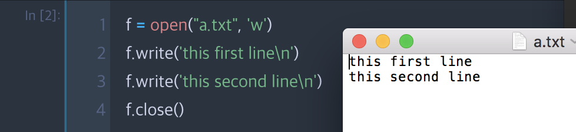

# 파일처리

### 파일 열기모드
|파일열기모드|	설명|
|-------|--------|
|r	|읽기모드 - 파일을 읽기만 할 때 사용|
|w	|기모드 - 파일에 내용을 쓸 때 사용|
|a	|추가모드 - 파일의 마지막에 새로운 내용을 추가 시킬 때 사용|
|b|	2진 모드(바이너리 모드)|
|t|	텍스트 모드 (기본값)|

## open 명령을 이용한 파일처리
`f = open("파일 경로/파일명.확장자", '파일열기모드')`


## 파일처리 예제
```python
f = open("a.txt", 'w', encoding='utf-8')    #encoding 타입은 선택사항
f.write('this first line\n')
f.write('this second line\n')
f.close()

```

\# 실행결과




## pickle
1) 쓰기

```python
import pickle
f = open('pickle.dat', 'wb')
pickle.dump(11, f)
pickle.dump("this is a line", f)
pickle.dump([1, 2, 3, 4], f)
f.close()

# pickle.dat 파일은 읽어볼 수 없습니다.
```

2) 읽기

```python
import pickle
f = open('pickle.dat', 'rb')
print(pickle.load(f))
print(pickle.load(f))
print(pickle.load(f))
f.close()


# 실행결과
11
this is a line
[1, 2, 3, 4]
```

## shelve
* shelve 라이브러리에서 제공하는 shelve는 key - value 형식으로 동작하는 JSON, dictionary 와 같이 동작하는 자료 객체

1) 쓰기

```python
import shelve
shelfFile = shelve.open('mydata')    # mydata라는 파일 생성
cats = ['Zophie', 'Pooka', 'Simon']    # cats라는 변수의 리스트 생성
shelfFile['cats'] = cats    # 'cats'라는 key의 value로 cats라는 리스트를 생성
shelfFile.close()
```

2) 읽기

```python
shelfFile = shelve.open('mydata')
print(shelfFile['cats'])    key가 'cats'인 value 출력
shelfFile.close()


# 실행결과
['Zophie', 'Pooka', 'Simon']
```
